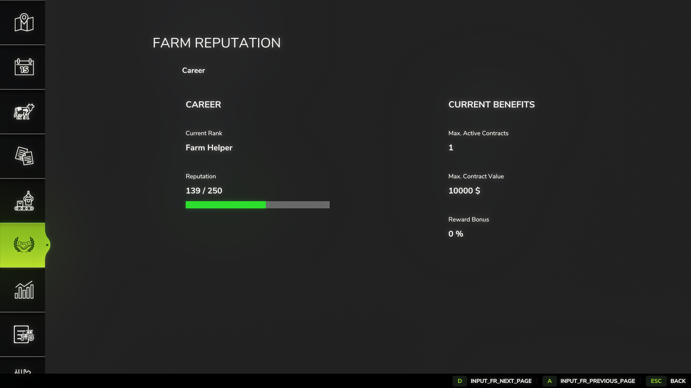
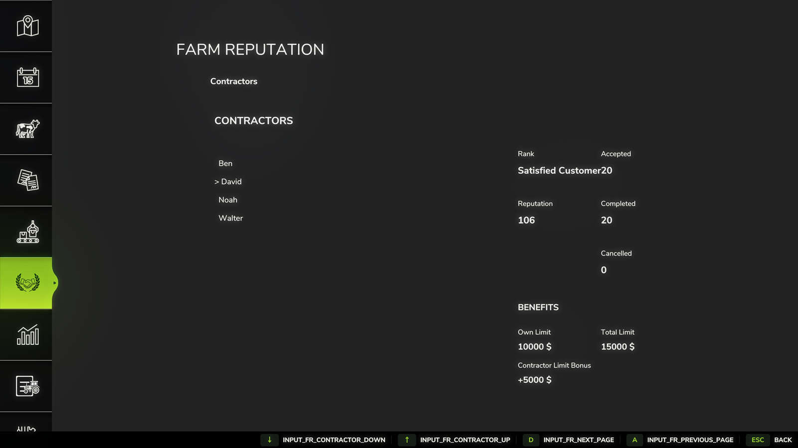
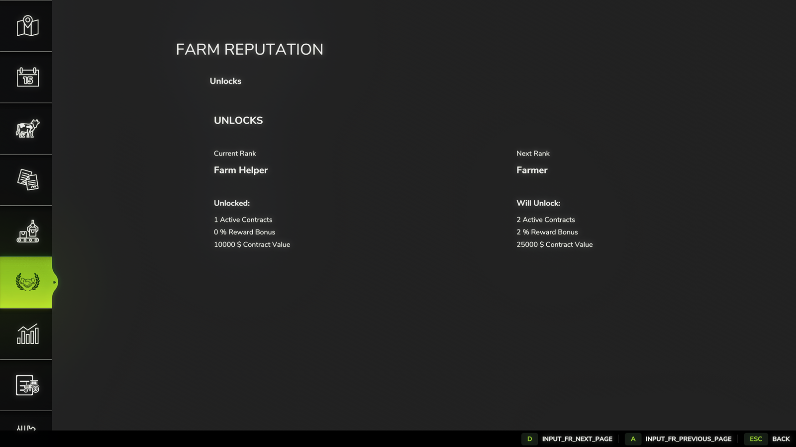
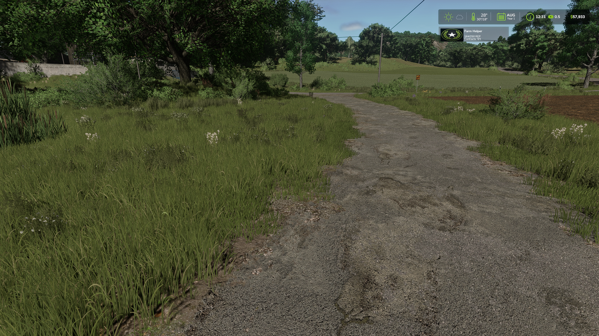

# 🌾 FS25 Farm Reputation


A reputation and progression system for **Farming Simulator 25** that rewards dedicated farmers with new bonuses, higher contract limits, and long-term progression.

---

# 📦 Dependency

**FS25 Farm Reputation requires the following mod to work:**

### Better Contracts
- **Author:** Mmtrx
- **Required:** Yes
- **Official ModHub:** [Better Contracts on ModHub](https://www.farming-simulator.com/mod.php?mod_id=307829)
- **GitHub Repository:** [Mmtrx/FS25_BetterContracts](https://github.com/Mmtrx/FS25_BetterContracts)

> ⚠️ Without **Better Contracts**, FS25 Farm Reputation will not load because it is defined as a required dependency in the mod configuration.

# ✨ Features

- 🏆 Reputation system with multiple ranks
- 📈 Earn reputation by completing contracts
- 💰 Reward bonus based on reputation
- 📦 Higher maximum contract value
- 📋 More active contracts with higher ranks
- ⭐ Unlock permanent reputation bonuses
- 💾 Savegame compatible
- 👥 Multiplayer support
- 🌍 Fully localized
  - German
  - English

---

## 📸 Screenshots

### Career



### Contractors



### Farm Evaluation


### Field Analysis


### Unlocks



### Clean Gameplay HUD


```

---

# 📥 Installation

1. Download the latest release.
2. Copy **FS25_FarmReputation.zip** into:

```
```text
Documents
└── My Games
    └── FarmingSimulator2025
        └── mods
```

3. Start Farming Simulator 25.
4. Activate the mod.
5. Enjoy your new reputation system!

---

# 🎮 How it works

Every completed contract grants reputation.

Increasing your reputation unlocks:

- higher rewards
- more simultaneous contracts
- higher contract values
- permanent bonuses

The better your reputation, the more opportunities become available.

---

# 🌍 Languages

- 🇩🇪 German
- 🇬🇧 English
- 🇫🇷 French

---

# 🤝 Contributing

Suggestions and bug reports are welcome.

Please open a GitHub Issue if you discover a bug or have an idea for a new feature.

---

# 🐞 Bug Reports

When reporting a bug, please include:

- Game version
- Mod version
- Other installed mods
- Log.txt
- Steps to reproduce

---

# 📜 License

Copyright © 2026 Benjamin Horstmann

This project is released under the **All Rights Reserved** license.

You may:

- Download the released mod.
- Use the mod in your game.

You may **not**:

- Reupload the mod.
- Modify and redistribute the mod without permission.
- Publish altered versions.

---

# ❤️ Support

If you enjoy this mod, consider supporting the project by:

⭐ Starring this repository

🐞 Reporting bugs

💡 Suggesting new features

---

# 👨‍💻 Author

Benjamin Horstmann (Narbenstahl)

GitHub:
https://github.com/Narbenstahl

YouTube:
https://www.youtube.com/@narbenstahl

## Credits

This project builds upon the excellent **Better Contracts** mod by **Mmtrx**.

Many thanks to Mmtrx for providing the foundation and public API that made this project possible.
